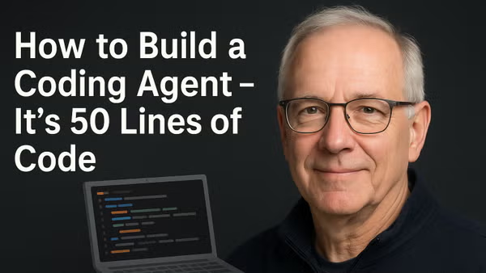

# How To Build A Coding Agent - In Powershell

Hands-on learning how to build AI agents with progressively increasing capabilities. This repository contains six different agent implementations that demonstrate the evolution from a simple chat interface to a fully capable agent with file system access, code search, and tool execution.

 
 

    

 
 

Coding Agents = loops + tools.

I’ll build one step-by-step in ~50 lines of PowerShell—live: prompts, routing, file edits.

No frameworks, no BS.

Join me 👇🏼
https://www.meetup.com/nycpowershellmeetup/events/310703474

